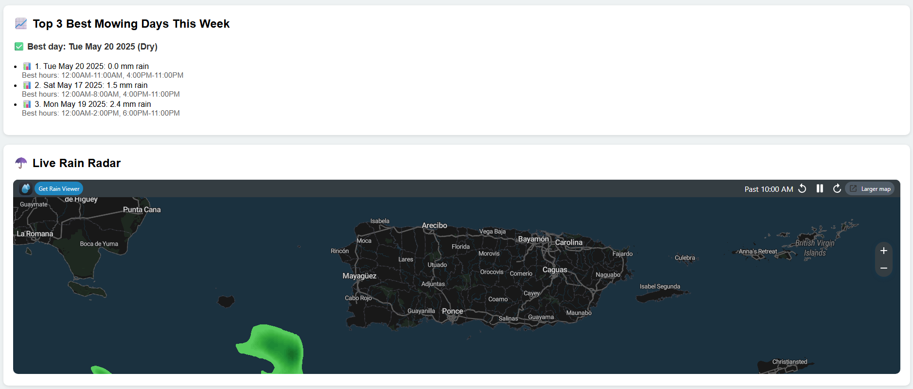

# Lawn Mowing Forecast Tool

A modern, interactive web app to help you plan the best days and times to mow your lawn based on real-time weather data and location.

---

## 🌟 Features

- **Location-based Forecast:** Enter your location manually, select from a Puerto Rico city dropdown, or use your device’s GPS for accurate, local weather.
- **Weather Condition Icons:** Instantly see today’s weather and the top mowing days with friendly icons and descriptions.
- **Top 3 Mowing Days:** Get the best three days for mowing this week, with recommended hours based on rain, temperature, and UV index, all shown in easy-to-read cards.
- **Interactive Map:** View your location on a map, adjust by clicking anywhere, and see a pin for your coordinates.
- **Bilingual Support:** Instantly switch between English and Spanish.
- **Live Rain Radar:** See real-time rain movement for your area, with zoom and fullscreen options.
- **Responsive Design:** Works great on desktop and mobile devices.
- **Dark Mode:** Toggle between light and dark themes for comfortable viewing.
- **URL Parameters:** Open the page with specific coordinates using `?lat=...&lon=...` in the URL.
- **Remembers Last Location:** Your last used coordinates are saved for your next visit.

---

## 🚀 How It Works

- Uses the [Open-Meteo API](https://open-meteo.com/) for weather data.
- Uses [OpenStreetMap](https://www.openstreetmap.org/) and [Leaflet.js](https://leafletjs.com/) for mapping and location.
- Analyzes hourly forecasts to recommend the safest and most comfortable mowing times, helping you avoid rain and extreme conditions.
- The city dropdown auto-fills coordinates for major cities in Puerto Rico.
- The app reads `lat` and `lon` from the URL if provided, so you can share or bookmark a specific location.

---

## 🖥️ Getting Started

1. **Clone or Download this Repository**
2. **Open `index.html` in your browser**

No build steps or dependencies required!

---

## 🌐 Publish on GitHub Pages

1. Create a new public repository on GitHub.
2. Upload your HTML file(s) (rename to `index.html` for best results).
3. Go to **Settings > Pages** and set the source to the root of the `main` branch.
4. Your site will be live at `https://your-username.github.io/your-repo-name/`.

---

## 📱 Screenshots

---

## 📝 License

This project is open source and free to use.

---

**Created by [Rikion]**

*Powered by Open-Meteo, OpenStreetMap, and Leaflet.js*